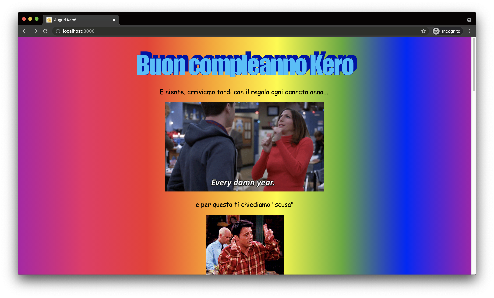

# Kero happy birthday 22

To wish an happy birthday to my sister Kero, I made a collection of silly photos and phrases to show her how nice I am.

| \                | \        |
|------------------|----------|
| Deploy status         | [](https://app.netlify.com/sites/kero-happy-birthday-22/deploys)        |
| Deploy preview   | https://kero-happy-birthday-22.netlify.app/        |
| Project typology | Personal |



## 🔥 Tech stack

| Purpose    | Technology   |
|:-----------|:-------------|
| Templating | HTML         |
| Styling    | SCSS + BEMIT |

## 🌊 Run development mode

Note: `npm i` is not required.

```shell
# serve at localhost:3000
npm run dev
```

### 🌿 Branches

| Branch name | Use         |
|:------------|:------------|
| `main`      | main branch |
